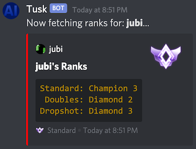

# 

**`TuskBot` is a Rocket League Discord Bot focused on tracking player ranks and in-game stats.**

## Getting Started

### [Install TuskBot](https://discordapp.com/oauth2/authorize?&client_id=708694380869058600&permissions=268848192&scope=bot) on your discord server

#### "Manage Roles" permission

If the "Manage Roles" permission is granted, `TuskBot` will create 19 new roles (unless they already exist).  These will be named:

- `Bronze I`
- `Bronze II`
- `Bronze II`
- `Silver I`
- `Silver II`
- `Silver III`
- `Gold I`
- `Gold II`
- `Gold III`
- `Platinum I`
- `Platinum II`
- `Platinum III`
- `Diamond I`
- `Diamond II`
- `Diamond III`
- `Champion I`
- `Champion II`
- `Champion III`
- `Grand Champion I`
- `Grand Champion II`
- `Grand Champion III`
- `Supersonic Legend`

Then: everytime a `!register` or `!ranks` is executed, that player will be automatically assigned the role of their highest rank.

You can choose to add this permission at any time and `TuskBot` will go to work adding these roles and assigning them to players upon execution of `!register` or `!ranks`

#### Type `!help`

Once the bot is installed, you can type `!help` to see a list of all possible commands.

### Register your Rocket League account

Most commands won't work unless you have registered your Rocket League account first:

```shell
!register <account-id> [platform]
```

- **Steam**:
  - **`<account-id>`**: This is the unique ID that identifies your steam account.  You can use either:
    - The number at the end of a link like `http://steamcommunity.com/profiles/76561198257073170`.  In this case it would be `76561198257073170`.
    - The text at the end of a link like `https://steamcommunity.com/id/jubishop`.  In this case it would be `jubishop`.
    - On the desktop version of Steam, you can find this link by right-clicking anywhere in the empty space of your profile and selecting `Copy Page Url`.  Then simply paste it into the address bar of your browser.
  - **`[platform]`**:  This defaults to steam, so you can omit it.
  - ***Example***: In this case, the player could register with: `!register 76561198257073170` or: `!register jubishop`.

- **XBox**:
  - **`<account-id>`**:  This is your Gamertag.
  - **`[platform]`**: This should be `xbox`.
  - ***Example***: If your Gamertag is `jubishop`, you'd register with: `!register jubishop xbox`
  - If your Gamertag contains spaces, wrap it in quotes: `!register "My Name" xbox`

- **Playstation**:
  - **`<account-id>`**:  This is your PSN.
  - **`[platform]`**: This should be `ps`.
  - ***Example***: If your PSN is `jubishop`, you'd register with: `!register jubishop ps`
  - If your PSN contains spaces, wrap it in quotes: `!register "My Name" ps`

- **Epic**:
  - **`<account-id>`**:  This is your Epic name.
  - **`[platform]`**: This should be `epic`.
  - ***Example***: If your Epic name is `jubishop`, you'd register with: `!register jubishop epic`
  - If your Epic name contains spaces, wrap it in quotes: `!register "My Name" epic`

- **Switch**:  Sorry, Switch is not yet supported.

#### Registering others

If you are the server's owner (or you're whitelisted), you can register people other than yourself.  The command is `!admin_register`, and the first param becomes the discord user to register.

- ***Steam Example***: `!admin_register @jubi jubishop`
- ***XBox Example***: `!admin_register @jubi jubishop xbox`
- ***PS Example***: `!admin_register @jubi jubishop ps`
- ***Epic Example***: `!admin_register @jubi jubishop epic`

### Role Assignments

#### Defining which playlists affect roles

By default, all playlists are considered when assigning roles. Server owners (or whitelisted users) can narrow this selection to any set of playlists they prefer using `!role_playlists`.  Playlist names are identified as:

- `standard`
- `doubles`
- `duel`
- `solo_standard`
- `rumble`
- `dropshot`
- `hoops`
- `snow_day`

Join the playlists you care about with a `|` between each one.  For example, if you want to only assign roles based on the ranks in the `doubles`, `standard`, and `solo_standard` playlists:

```shell
!role_playlists doubles|standard|solo_standard
```

If you run `!role_playlists` with no parameters, it'll show you what playlists are currently being used.

If you want to go back to the default, run `!clear_role_playlists`.

#### Updating all roles

Server owners (or whitelisted users) can also update the role of every registered user in the channel with `!update_all_roles`.

## Ranks

```shell
!ranks [member]
```



- To get your own ranks, simply type `!ranks`
- To get the ranks of another registered player, follow the command with the name, nickname, or @ of another discord member.
  - ***Example***: `!ranks jubi`
  - ***Example***: `!ranks @jubi`
- If the `Manage Roles` permission has been granted, every time a rank is checked, the role of that player will be updated to their current highest rank.
- Because Psyonix provides no official API for accessing console ranks, the ranks TuskBot reports for Playstation and XBox accounts may be somewhat outdated.  😕

## Stats

There are 2 commands for getting stats in various ways.

### Series Stats

Lifetime stats aren't great for comparing players.  Someone who mostly plays Duel 1v1 is going to have wildly different stats than someone that prefers Standard 3v3.  The `!series` command provides a way to view stats for the specific games where all the players were playing together.  This makes for much more interesting comparisons.

```shell
!series [member1] [member2] [member3] ...
```


- You can click the :arrow_left: and :arrow_right: buttons to flip between the different pages of statistics.
- To fetch your own stats, simply type `!series`
- This data is gathered from [ballchasing.com](http://ballchasing.com).  Stats are generated from the uploaded replays of the player who executes the `!series` command.  Your replays must be marked `public` for TuskBot to access them.  The easiest way to have all your replay files automatically uploaded is using [BakkesMod](https://bakkesmod.com/).  You can find instructions [here](https://ballchasing.com/doc/faq#upload).
- **If you do not upload your replays to [ballchasing.com](http://ballchasing.com), you will get 0 results from `!series`.**
- Because of API rate limits, `!series` will only work off the games you've played in the last 72 hours.
- If you provide a list of players it will display a table so their stats can be easily compared side by side.  You can fetch up to 6 players at a time.
- After a session of playing Doubles together, the image above was generated with the command:

```shell
!series @jubi @FezDispenser
```

### Alltime Series Stats

Everytime a `!series` command is executed, `TuskBot` stores those replays in its own database.  The `!alltime` command uses those stored replays to show you the aggregate data of all the `!series` commands you've ever run.  So as long as you execute a `!series` command at least once every 36 hours, you'll be able to use `!alltime` to get the complete comparative stats of your games ever since you began using `TuskBot`.

```shell
!alltime [member1] [member2] [member3] ...
```

- The display format for `!alltime` is exactly the same as `!series`.
- The `!alltime` command will only pull data from the stored replays inside its local database.  Only the `!series` command will get new data from [ballchasing.com](http://ballchasing.com)
- **If you do not upload your replays to [ballchasing.com](http://ballchasing.com), or you never run the `!series` command, you will get 0 results from `!alltime`.**

### Custom Command Prefix

By default, `TuskBot` will accept commands when you address it directly via `@Tusk` or prefix your command with `!`.  Server owners can change this with `!set_command_prefix`.  To change it to `@`:

```shell
!set_command_prefix @
```

Now all commands will begin with `@`.  If you wanted to change it back to `!`:

```shell
@set_command_prefix !
```

If you ever forget what your command prefix is, you can address `@Tusk` directly to find out:

```shell
@Tusk command_prefix
```

Note: The maximum command prefix length is 8 characters.

### URL Commands

Use the `!help` command to learn about simple commands to get URLs to specific player pages on [ballchasing.com](http://ballchasing.com), [calculated.gg](http://calculated.gg), [rocketleague.tracker.network](http://rocketleague.tracker.network), etc.

## Try it out before installing

You're welcome to [join the server](https://discord.gg/2YSmnyX) where `TuskBot` was developed and try it out for yourself.

## Bugs / Feedback

Feel free to file issues on [github](https://github.com/jubishop/Tusk/issues) or to hit me up in my [discord channel](https://discord.gg/2YSmnyX), I'm `@jubi`.
